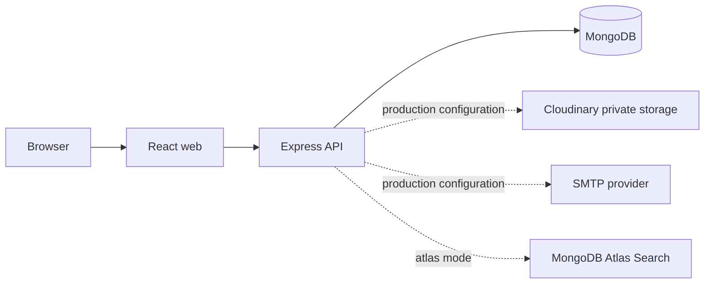

# Job Board

A production-oriented TypeScript MERN Job Board. Applicants can manage a profile and private resume, discover and save Jobs, apply, and track Applications. Employers manage a Company, Jobs, and an authorization-scoped hiring pipeline.

This is a portfolio engineering project: it emphasizes explicit security boundaries, test isolation, portable containers, observable API behavior, and evidence-based scaling—not unverified production claims.

## Capabilities

| Capability | Status |
| --- | --- |
| Applicant and Employer authentication | Implemented |
| Profiles, Company ownership, and Job lifecycle | Implemented |
| Public search, filters, facets, and autocomplete | Implemented |
| Atlas Search mode | Environment prerequisite |
| Private resume storage and Application snapshots | Storage provider prerequisite in production |
| Email verification, password reset, notifications | SMTP prerequisite in production |
| Docker production images and CI quality gates | Implemented |
| Production deployment automation | Not implemented |
| Redis, queues, AI, payments, recruiter teams | Not implemented |

## Architecture



The application is a modular monolith: one React client, one Express API, and MongoDB. This keeps the transactional model and operation surface understandable while preserving provider and module boundaries for future scale work. See [architecture overview](docs/architecture/overview.md).

## Stack

- Frontend: React 19, Vite, React Router, TanStack Query, React Hook Form, Zod
- API: Node.js 24, Express 5, TypeScript, Mongoose, Zod, Pino
- Security: Argon2id, JOSE JWT validation, Helmet, CORS, rate limiting
- Providers: Cloudinary private raw storage, Nodemailer SMTP, optional Atlas Search
- Quality: Vitest, Supertest, Testing Library, ESLint, Docker, GitHub Actions

## Repository layout

```text
apps/web              React client
apps/api              Express API and MongoDB models
packages/contracts    Shared public API contracts
docs/                 Architecture, API, operations, performance, portfolio docs
scripts/performance   Guarded local autocannon tooling
docker/               API/web Dockerfiles and Nginx config
.github/workflows     Read-only CI quality and image-build gates
```

## Quick start

Prerequisites: Node.js 24+, npm 11+, and Docker Desktop for the containerized path.

```powershell
Copy-Item .env.example .env
# Generate a value, then place it in ACCESS_TOKEN_SECRET in .env
node -e "console.log(require('node:crypto').randomBytes(48).toString('base64url'))"
npm ci
docker compose up --build
```

Compose starts MongoDB, the API at `http://localhost:3000`, and the web app at `http://localhost:5173`. It supplies the API's dependencies; do not also run `npm run dev` against the same ports. For a host-run workflow, start MongoDB first and run `npm run dev`.

The example environment contains placeholders only. Before starting the API, replace `ACCESS_TOKEN_SECRET` with the generated value (at least 32 characters). Development uses console email and basic MongoDB search; resume operations need configured Cloudinary credentials. Full setup and variable guidance: [development setup](docs/development/setup.md).

## Commands

| Command | Purpose |
| --- | --- |
| `npm run dev` | Start web and API together on the host |
| `npm run build` | Build contracts, API, and web |
| `npm run lint` / `npm run typecheck` | Static quality checks |
| `npm run test` | Workspace tests; Mongo integration tests need `RUN_MONGODB_TESTS=1` |
| `npm run test:coverage` | Informational V8 coverage |
| `npm run perf:seed` / `perf:smoke` | Guarded local performance dataset and public profile |

## Engineering highlights

- Short-lived bearer access tokens with rotating, hashed refresh credentials in HttpOnly cookies.
- Ownership-scoped authorization and database uniqueness rules for Company, Application, and SavedJob invariants.
- Private current resumes and immutable per-Application snapshots; raw resume bytes and signed URLs are not stored in MongoDB.
- Basic local MongoDB search plus an explicit Atlas Search mode; the runtime never provisions Atlas indexes.
- Structured logs, request IDs, liveness/readiness, Prometheus-compatible bounded metrics, and non-root production images.

## Documentation

- [Architecture overview](docs/architecture/overview.md), [data model](docs/architecture/data-model.md), [authentication](docs/architecture/authentication.md), [lifecycles](docs/architecture/lifecycles.md), [search](docs/architecture/search.md), [decisions](docs/architecture/decisions.md)
- [API overview](docs/api/overview.md), [development setup](docs/development/setup.md), [testing](docs/development/testing.md), [security](docs/operations/security.md)
- [Deployment guide](docs/operations/deployment.md), [release checklist](docs/operations/release-checklist.md), [operations runbook](docs/operations/runbook.md)
- [Performance baseline](docs/performance/baseline.md), [capacity guidance](docs/performance/capacity.md)
- [Portfolio overview](docs/portfolio/project-overview.md), [interview notes](docs/portfolio/interview-notes.md)

## Deployment and limitations

Status: **PROVIDER-NEUTRAL RELEASE READY**. CI validates code and builds production images, but no cloud provider, live demo, or deployment automation is configured. Production requires a production MongoDB deployment, HTTPS, a strong access-token secret, SMTP, Cloudinary credentials, and explicit search configuration. See [deployment](docs/operations/deployment.md).

Current limitations include one Company per Employer, page/limit pagination, per-instance rate limiting, no recruiter teams, no messaging/interview scheduling, and no background workers. Possible future work includes multi-recruiter teams, a shared limiter or cache when measured, durable notification delivery, and cursor pagination where deep-page evidence warrants it.
