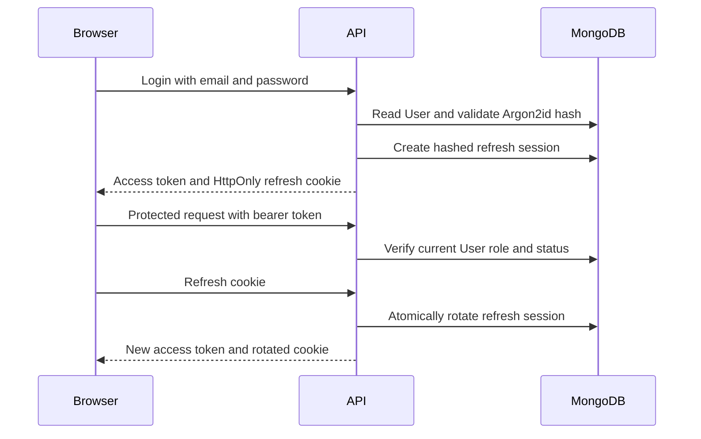

# Authentication and authorization

Registration and login authenticate either `APPLICANT` or `EMPLOYER` accounts. Passwords are Argon2id hashes. Login returns a short-lived access token for in-memory browser use and sets an opaque refresh credential in a host-only, HttpOnly, SameSite-Lax cookie scoped to `/api/v1/auth`.

Refresh-session hashes, previous hashes, expiry, revocation, and last-use metadata are persisted. Reuse of the immediately previous token revokes the active session; logout revokes the presented session. Password reset revokes all refresh sessions. Verification and reset credentials are high-entropy, purpose-specific, single-use values stored only as SHA-256 digests.

Authorization is server-side: protected routes validate JWT issuer/audience/expiry, load the current User, require the role, and constrain database reads/writes to the authenticated principal or owned Company. Client role values and identifiers never establish access.
