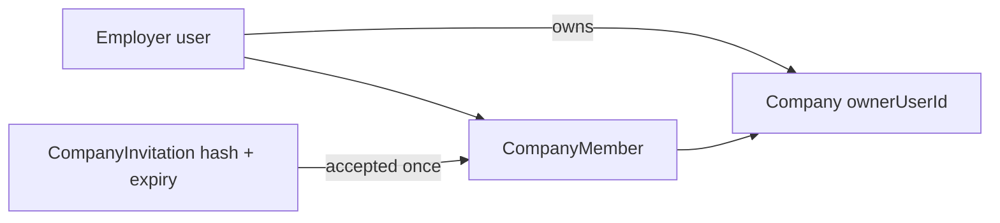

# Company teams

Phase 19 adds a deliberately small company collaboration model. Platform authentication remains `EMPLOYER`; company access is resolved from MongoDB on each protected employer operation as `OWNER` or `RECRUITER`.

`Company.ownerUserId` remains the authoritative owner invariant. A matching `CompanyMember` OWNER record is created for new companies, but legacy owners retain access even without that row. Recruiters are represented only by `CompanyMember` records, with a unique `{ companyId, userId }` index.

Owners can edit their company, invite/revoke recruiters, and remove recruiters. Recruiters can view the team and collaborate on company jobs and applications, including immutable application resume snapshots. Both roles are scoped strictly through the Job/Application company ID; `Job.createdBy` is provenance, never authorization.

Invitation tokens are 32-byte random values delivered only in email. MongoDB stores a SHA-256 hash, expiry, and accepted/revoked state; links use the configured trusted web origin rather than request headers. Invitations expire after seven days. The team and pending-invitation limits are both 25. Membership is deliberately one-company-per-employer in this phase.

Ownership transfer, additional company roles, departments, custom permissions, per-job assignments, billing, and team notifications are intentionally deferred.
