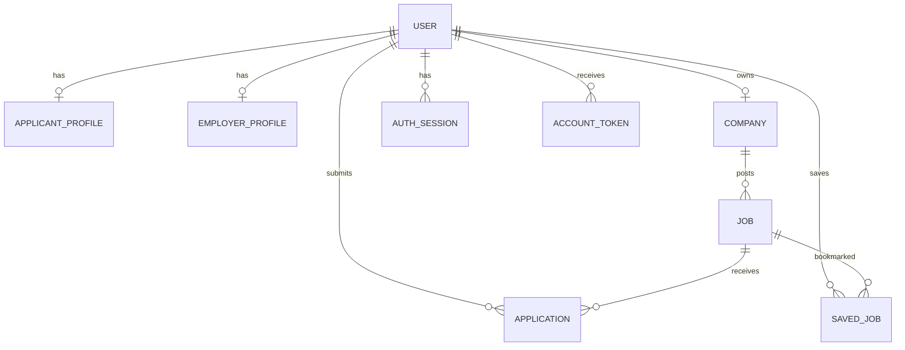

# Data model

MongoDB stores application records and metadata, not resume bytes, tokens, or signed URLs. Schemas use strict mode, timestamps, and targeted indexes.

| Collection | Purpose and key invariants |
| --- | --- |
| `User` | Account identity; unique normalized email, role, account status, password hash. |
| `AuthSession` | Hashed rotating refresh credential; unique current hash and TTL expiry. |
| `AccountToken` | Hashed verification/reset token; one active token per User/purpose plus TTL. |
| `ApplicantProfile` / `EmployerProfile` | One optional profile per matching User. |
| `Company` | One Company per Employer owner; unique owner and public slug. |
| `Job` | Company-owned listing; unique slug, status/published indexes, weighted text index. |
| `Application` | Applicant/Job/Company record; unique `(jobId, applicantUserId)` and lifecycle indexes. |
| `SavedJob` | Private bookmark; unique `(applicantUserId, jobId)` and newest-first index. |

Application stores an immutable snapshot's safe metadata. ApplicantProfile stores the current resume's safe metadata. Neither stores raw files or permanent/signed access URLs.
