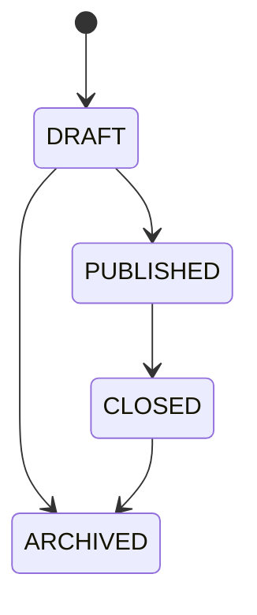
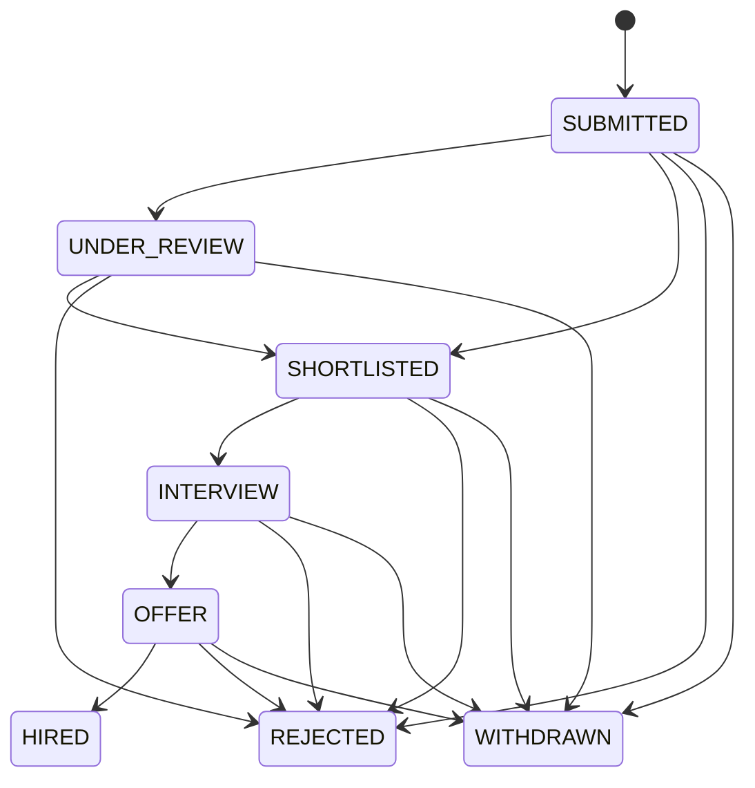
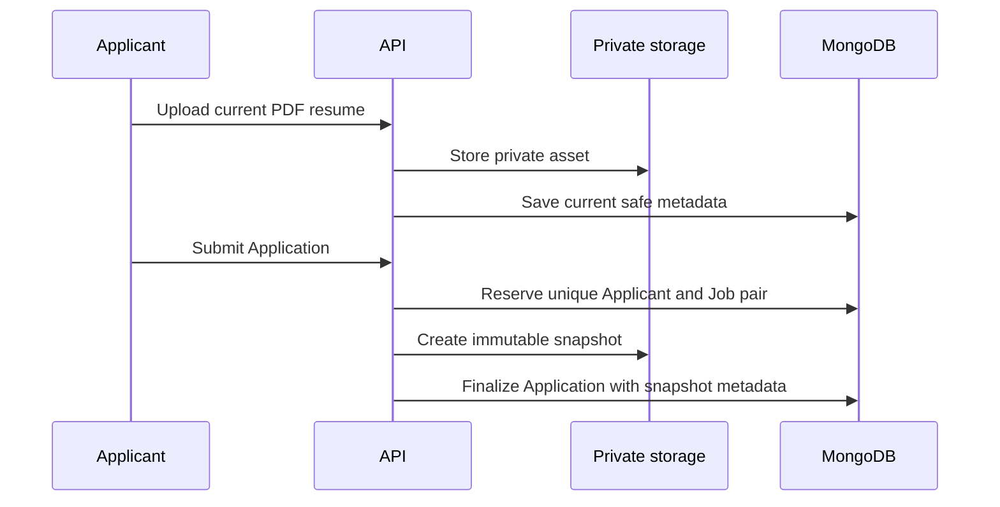

# Job, Application, and resume lifecycles

## Job lifecycle

Only Draft and Published Jobs can be edited. Public reads require `PUBLISHED` and a non-expired deadline; reads do not silently change status.

## Application lifecycle

`CREATING` is a technical reservation and never appears in Applicant-facing results.

The database unique index prevents duplicate Applicant/Job Applications. Status updates are conditional on the current status, protecting Employer-review and Applicant-withdrawal races.

## Resume flow

A snapshot is independent of later current-resume replacement/deletion. Snapshot failure prevents a successful Application; a failure after snapshot creation triggers a cleanup attempt. Notification delivery is best effort after the database mutation and never rolls the mutation back.
