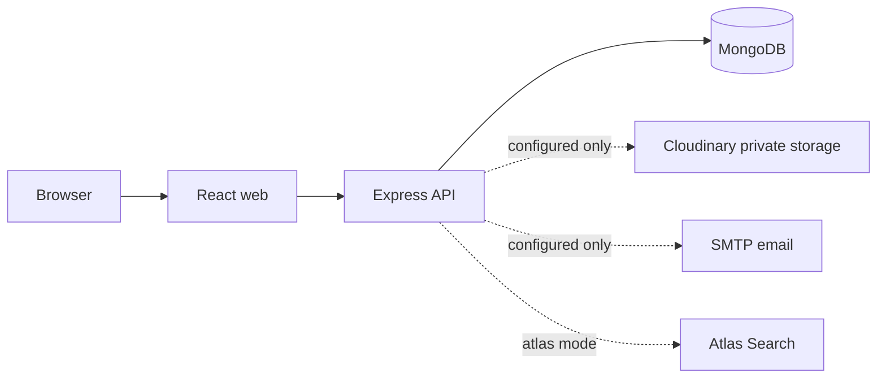
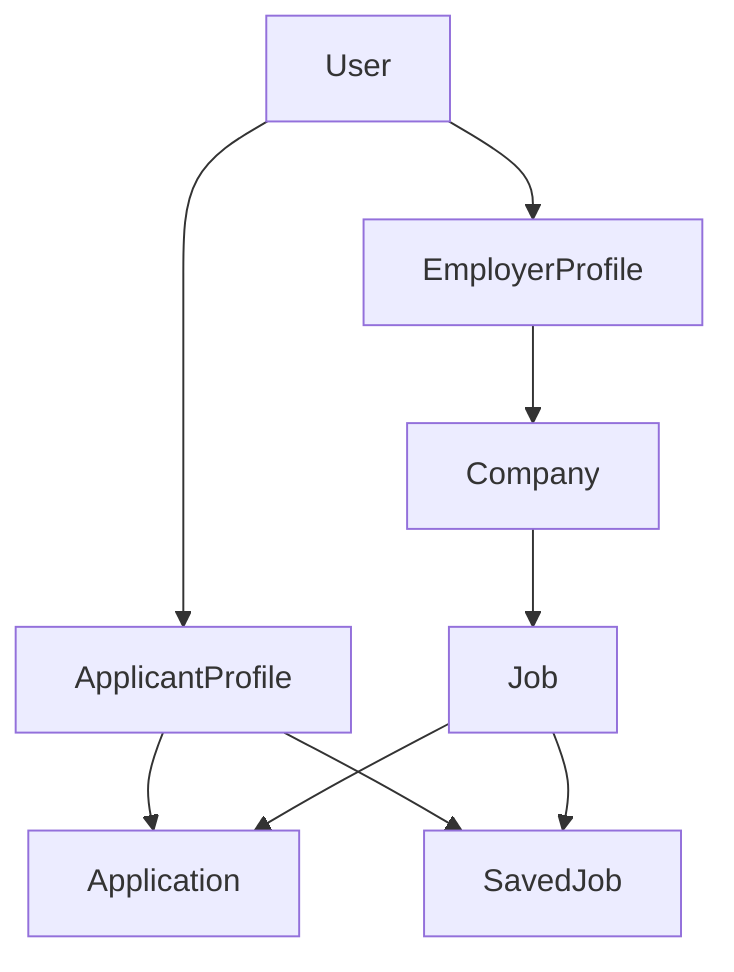

# Architecture overview

[README](../../README.md) · [data model](data-model.md) · [authentication](authentication.md)

The project is a modular monolith. React owns presentation and browser state; Express owns HTTP validation, authorization, provider boundaries, and feature modules; MongoDB is the transactional document store. Microservices are deferred: current modules share one data model and deployment boundary, which reduces operational complexity without preventing later stateless API replication.

The API uses narrow models and feature services instead of a generic repository/service framework. Public routes serialize safe fields; private routes require a verified account role and enforce ownership in database filters. Providers are deliberately narrow: resume storage and email can evolve independently without becoming standalone services.
