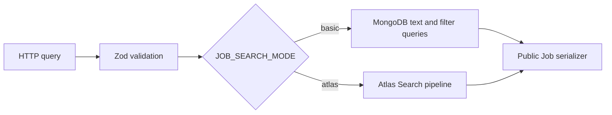

# Search architecture

Public Job search validates a bounded HTTP query before constructing an application-owned MongoDB filter. Results always apply public eligibility and salary visibility rules, then serialize safe Job/Company cards.

`basic` is the local, Docker, test, and CI mode. It uses the weighted `job_public_text` MongoDB text index, escaped exact structured filters, facets, and bounded page/limit pagination. `atlas` is an explicit production option: `ATLAS_SEARCH_INDEX` must name an index provisioned outside application startup. Atlas mode has no silent fallback after an Atlas query failure.

Autocomplete is a separate public endpoint with a two-character minimum and at most eight Job-title/skill suggestions. Basic text matching is not fuzzy or semantic search. Atlas fuzzy behavior is configured only in the Atlas query builder and has not been presented as a locally verified capability.

Deep offset pagination and search index propagation are deliberate limitations. Cursor pagination and Atlas tuning are future, measured changes rather than current infrastructure.
